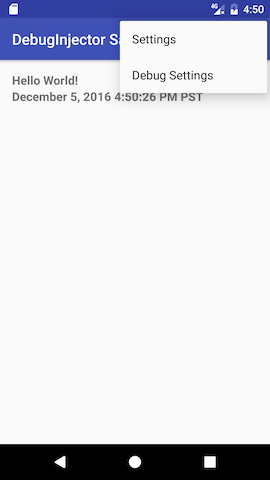
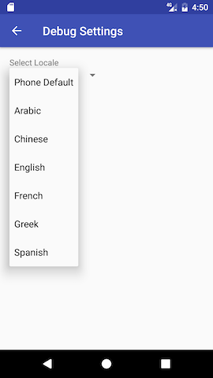
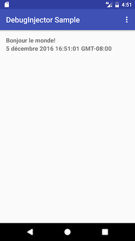

# DebugInjector Pattern Sample

## Overview

This repo describes the DebugInjector Pattern, demonstrating how to securely
implement debug-only functionality in an Android application.

## Locale Hello World Application

The sample consists of a simple Hello World application that supports multiple locales. The **Debug Settings** menu is only available when `BuildConfig.DEBUG==true` and displays a settings activity that allows the developer to switch the locale from within the application.

**Use Cases**

* As an app developer or tester, I want to easily test locale changes in debug builds.
* As a project manager, I want to ensure debug functionality is not included in release builds
(for security and efficiency purposes).
* As a hacker, I **SHALL NOT** be able to exercise or reverse engineer any of the debug functionality in a release build.

**Screen Shots**


  
  


## DebugInjector Pattern

The DebugInjector Pattern is the name for the common technique of adding debug-only functionality to applications. The key is to encapsulate the debug functionality in a manner that allows the behavior to be totally absent from release builds. The Android platform makes this easy by providing the ability to use different versions of a source or resource file for a given build variant
(see [sourceSets](https://developer.android.com/studio/build/build-variants.html#sourcesets)).

### Abstract Class

The Locale Hello World App demonstrates this pattern in the `DebugInjector.java` class. This
abstract class defines all the behavior available to debug builds and provides a static creation method to encapsulate instantiation to this file.


**src/main/java/com/blackpixel/debuglocale/injector/DebugInjector.java**
```java
/**
 * Abstract class demonstration of the DebugInjector Pattern.
 *
 * This class defines the behavior for the debug-only functionality
 * and provides a convenience method for instantiating the build type specific
 * implementation.
 */
public abstract class DebugInjector {
    private static DebugInjector sDebugInjector;

    public static DebugInjector getInstance(Context context) {
        if (sDebugInjector == null) {
            // There are 2 versions of DebugInjectorImpl.java
            //    debug - actual implementation
            //    release - no-op implementation
            sDebugInjector = new DebugInjectorImpl(context);
        }
        return sDebugInjector;
    }

    public abstract void startSettingsActivity(Activity activity);

    public abstract boolean overrideLocale(Activity activity);
}
```

### Debug and Release Implementations

The implementation is distributed across two `DebugInjectImpl.java` classes provided in the
`/debug` and `/release` folders. The `/release` version provides a simple no-op implementation, while the `/debug` version does the real work.

**src/release/java/com/blackpixel/debuglocale/injector/DebugInjectorImpl.java**
```java
public class DebugInjectorImpl extends DebugInjector {
    public DebugInjectorImpl(Context context) {
    }

    @Override
    public void startSettingsActivity(Activity activity) {
    }

    @Override
    public boolean overrideLocale(Activity activity) {
        return false;
    }
}
```

**src/debug/java/com/blackpixel/debuglocale/injector/DebugInjectorImpl.java**
```java
public class DebugInjectorImpl extends DebugInjector {
    private final static String PREFS_DEBUG_SETTINGS = "com.blackpixel.debuglocale.injector.pref_debug_setting";

    @VisibleForTesting
    final static String PREF_DEBUG_LOCALE = "pref_debug_locale";

    @VisibleForTesting
    SharedPreferences sharedPrefs;

    @VisibleForTesting
    Locale originalDefaultLocale;

    public DebugInjectorImpl(Context context) {
        this.sharedPrefs = context.getSharedPreferences(PREFS_DEBUG_SETTINGS, Context.MODE_PRIVATE);
    }

    @Override
    public void startSettingsActivity(Activity activity) {
        activity.startActivity(DebugSettingsActivity.newIntent(activity));
    }

    @Override
    public boolean overrideLocale(Activity activity) {
        boolean override = false;

        if (originalDefaultLocale == null) {
            originalDefaultLocale = Locale.getDefault();
        }

        Locale currentLocale = Locale.getDefault();
        String localeCode = sharedPrefs.getString(PREF_DEBUG_LOCALE, "");
        boolean isPhoneDefault = localeCode.isEmpty();
        Locale locale = isPhoneDefault ? originalDefaultLocale : new Locale(localeCode);
        if (!currentLocale.equals(locale)) {
            setLocale(locale, activity);
            override = true;
        }
        return override;
    }

    @VisibleForTesting
    void setLocale(Locale locale, Activity activity) {
        Resources resources = activity.getResources();
        Configuration config = resources.getConfiguration();
        config.setLocale(locale);

        Locale.setDefault(locale);
        activity.getResources().updateConfiguration(config, null);
    }
}
```

### Debug Manifest Files

The functionality in this sample includes a debug-only Activity that needs to be declared in
the `/debug` version of the `AndroidManifest.xml` file. This takes advantage of Android's
[Manifest Merge](https://developer.android.com/studio/build/manifest-merge.html) capabilities,
which is really cool but has also gotten me into trouble a couple of times with third-party libraries.

**src/debug/AndroidManifest.xml**
```xml
<manifest xmlns:android="http://schemas.android.com/apk/res/android">
    <application>
        <activity
            android:name="com.blackpixel.debuglocale.injector.DebugSettingsActivity"
            android:label="@string/title_activity_debug_settings">
            <meta-data
                android:name="android.support.PARENT_ACTIVITY"
                android:value="com.blackpixel.debuglocale.MainActivity" />
        </activity>
    </application>
</manifest>
```

### Putting It All Together

The debug functionality is initiated from the `MainActivity.java` class. This class calls the
`DebugInejctor.getInstance()` method and assigns the result to a method variable. The
`startSettingsActivity()` is then called to respond to the **Debug Settings** menu click, and `getOverrideLocale()` is called from the `onResume` override.

**src/main/java/com/blackpixel/debuglocale/MainActivity.java**
```java
public class MainActivity extends AppCompatActivity {
    private DebugInjector debugInjector = null;

    private TextView helloWorldTextView;
    private TextView dateTimeTextView;

    @Override
    protected void onCreate(Bundle savedInstanceState) {
        super.onCreate(savedInstanceState);
        setContentView(R.layout.activity_main);

        helloWorldTextView = (TextView) findViewById(R.id.main_hello_world_tv);
        dateTimeTextView = (TextView) findViewById(R.id.main_date_time_tv);

        if (BuildConfig.DEBUG) {
            debugInjector = DebugInjector.getInstance(this);
        }
    }

    @Override
    public void onResume() {
        super.onResume();
        if (BuildConfig.DEBUG) {
            debugInjector.overrideLocale(this);
        }
        updateUi();
    }

    private void updateUi() {
        helloWorldTextView.setText(R.string.hello_world);
        dateTimeTextView.setText(DateFormat.getDateTimeInstance(DateFormat.LONG, DateFormat.LONG)
                .format(new Date()));
    }

    @Override
    public boolean onOptionsItemSelected(MenuItem item) {
        boolean handled;

        switch (item.getItemId()) {
            case R.id.setting_app:
                handled = true;
                break;
            case R.id.setting_debug:
                if (BuildConfig.DEBUG) {
                    debugInjector.startSettingsActivity(this);
                }
                handled = true;
                break;
            default:
                handled = super.onOptionsItemSelected(item);
                break;
        }
        return handled;
    }
}
```

### Unit Testing

Android's Unit Test framework also supports folder-based build variant overrides. This
requires any Unit Tests written against the debug version of `DebugInjectImpl.java` to be placed under the `/testDebug` folder.

**src/testDebug/java/com/blackpixel/debuglocale/injector/DebugInjectorImplTest.java**
```java
/**
 * Verify actual behavior from debug build type.
 */
@RunWith(MockitoJUnitRunner.class)
public class DebugInjectorImplTest {
    @Mock
    Context mockContext;

    private DebugInjectorImpl debugInjector;

    @Before
    public void setUp() {
        debugInjector = spy(new DebugInjectorImpl(mockContext));
        debugInjector.sharedPrefs = mock(SharedPreferences.class);

        // is there a better way to override this internal method?
        doAnswer(new Answer<Void>() {
            public Void answer(InvocationOnMock invocation) {
                return null;
            }
        }).when(debugInjector).setLocale(any(Locale.class), any(Activity.class));
    }

    @Test
    public void startSettingsActivity() throws Exception {
        Activity activity = mock(Activity.class);
        debugInjector.startSettingsActivity(activity);

        verify(activity).startActivity(any(Intent.class));
    }

    @Test
    public void overrideLocaleInitialDefault() throws Exception {
        Activity activity = mock(Activity.class);
        debugInjector.originalDefaultLocale = null;

        when(debugInjector.sharedPrefs.getString(eq(DebugInjectorImpl.PREF_DEBUG_LOCALE), anyString()))
            .thenReturn("");

        assertFalse(debugInjector.overrideLocale(activity));

        verify(debugInjector, never()).setLocale(any(Locale.class), any(Activity.class));
        assertEquals(Locale.getDefault(), debugInjector.originalDefaultLocale);
    }

    @Test
    public void overrideLocaleInitialChange() throws Exception {
        Activity activity = mock(Activity.class);
        String originalLanguage = "en";
        String newLanguage = "fr";
        debugInjector.originalDefaultLocale = new Locale(originalLanguage);

        when(debugInjector.sharedPrefs.getString(eq(DebugInjectorImpl.PREF_DEBUG_LOCALE), anyString()))
                .thenReturn(newLanguage);

        assertTrue(debugInjector.overrideLocale(activity));

        ArgumentCaptor<Locale> captor = ArgumentCaptor.forClass(Locale.class);
        verify(debugInjector).setLocale(captor.capture(), any(Activity.class));
        assertEquals(newLanguage, captor.getValue().getLanguage());
        assertEquals(originalLanguage, debugInjector.originalDefaultLocale.getLanguage());
    }
}
```

**src/testRelease/java/com/blackpixel/debuglocale/injector/DebugInjectorImplTest.java**
```java
/**
 * Verify No-op behavior from release build type.
 */
@RunWith(MockitoJUnitRunner.class)
public class DebugInjectorImplTest {

    @Mock
    Context mockContext;

    DebugInjectorImpl debugInjector;

    @Before
    public void setUp() {
        debugInjector = spy(new DebugInjectorImpl(mockContext));
    }

    @Test
    public void startSettingsActivity() throws Exception {
        Activity activity = mock(Activity.class);
        debugInjector.startSettingsActivity(activity);
        verify(debugInjector).startSettingsActivity(any(Activity.class));
        verifyNoMoreInteractions(debugInjector);
        verifyZeroInteractions(activity);
    }

    @Test
    public void overrideLocaleInitialDefault() throws Exception {
        Activity activity = mock(Activity.class);
        assertFalse(debugInjector.overrideLocale(activity));
        verify(debugInjector).overrideLocale(any(Activity.class));
        verifyNoMoreInteractions(debugInjector);
        verifyZeroInteractions(activity);
    }
}
```
